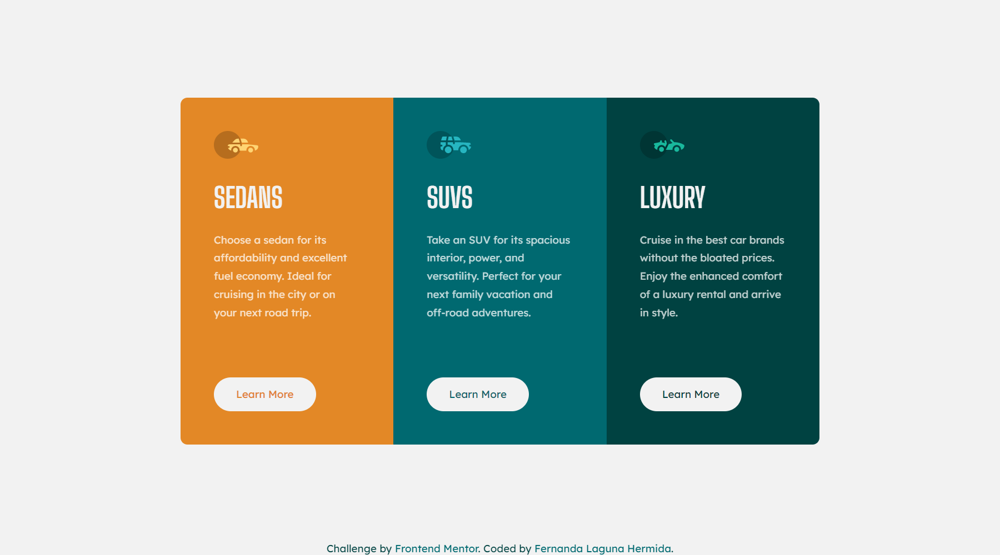

# Frontend Mentor - 3-column preview card component solution

This is a solution to the [3-column preview card component challenge on Frontend Mentor](https://www.frontendmentor.io/challenges/3column-preview-card-component-pH92eAR2-). Frontend Mentor challenges help you improve your coding skills by building realistic projects. 

## Table of contents

- [Overview](#overview)
  - [The challenge](#the-challenge)
  - [Screenshot](#screenshot)
  - [Links](#links)
- [My process](#my-process)
  - [Built with](#built-with)
  - [What I learned](#what-i-learned)
  - [Continued development](#continued-development)
  - [Useful resources](#useful-resources)
- [Author](#author)

## Overview

### The challenge

Users should be able to:

- View the optimal layout depending on their device's screen size
- See hover states for interactive elements

### Screenshots

### Links

- Solution URL: https://www.frontendmentor.io/solutions/responsive-component-with-flexbox-and-custom-icon-system-shxLv0NOJG
- Live Site URL: https://ferlagher.github.io/FMC-3-column-preview/

## My process

I wanted to try [this way](https://css-tricks.com/svg-sprites-use-better-icon-fonts/) of using SVGs. I was using inline SVGs until now, but it wasn't easy to manage when I had many icons in one HTML file.
I combined all the images in a single SVG file using `<symbol>`. I gived every `<symbol>` an ID so I can use it in my page.

### Built with

- Semantic HTML5 markup
- Sass ♥
- Flexbox
- CSS Grid
- Custom Icon System

### What I learned

Today I learned how to create an icon system and how to use the *viewBox* attribute to scale my SVGs.

### Continued development

Next challenge: [Huddle landing page with a single introductory section](https://www.frontendmentor.io/challenges/huddle-landing-page-with-a-single-introductory-section-B_2Wvxgi0/hub/huddle-landing-page-with-a-single-introductory-section-VW3TR5ej7a)

### Useful resources

- [Icon System with SVG Sprites](https://css-tricks.com/svg-sprites-use-better-icon-fonts/)
- [SVG `symbol` a Good Choice for Icons](https://css-tricks.com/svg-symbol-good-choice-icons/)
- [How to Scale SVG](https://css-tricks.com/scale-svg/)

## Author

- LinkedIn - [ferlagher](https://www.linkedin.com/in/ferlagher/)
- Frontend Mentor - [@ferlagher](https://www.frontendmentor.io/profile/ferlagher)
- Instagram - [@ferlagher](https://www.instagram.com/ferlagher/)

Thank you very much for reading. ♥
